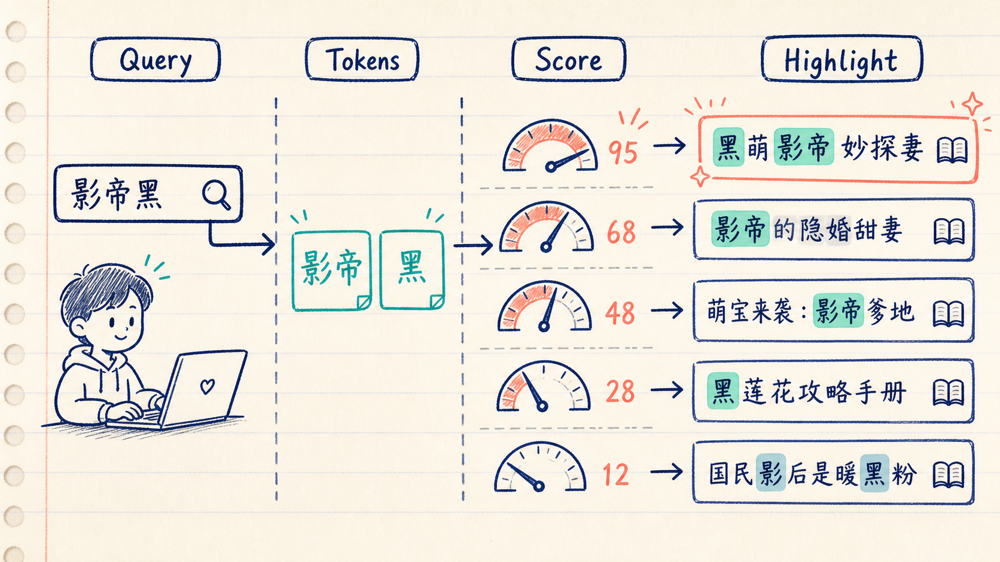
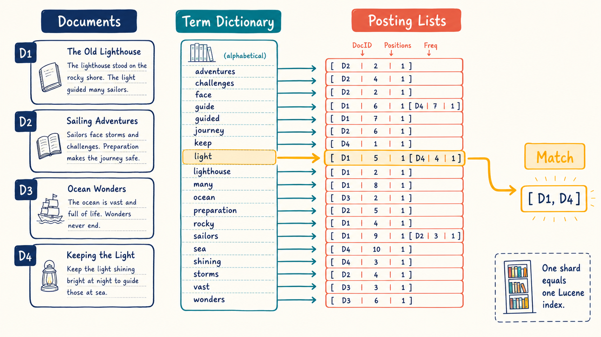
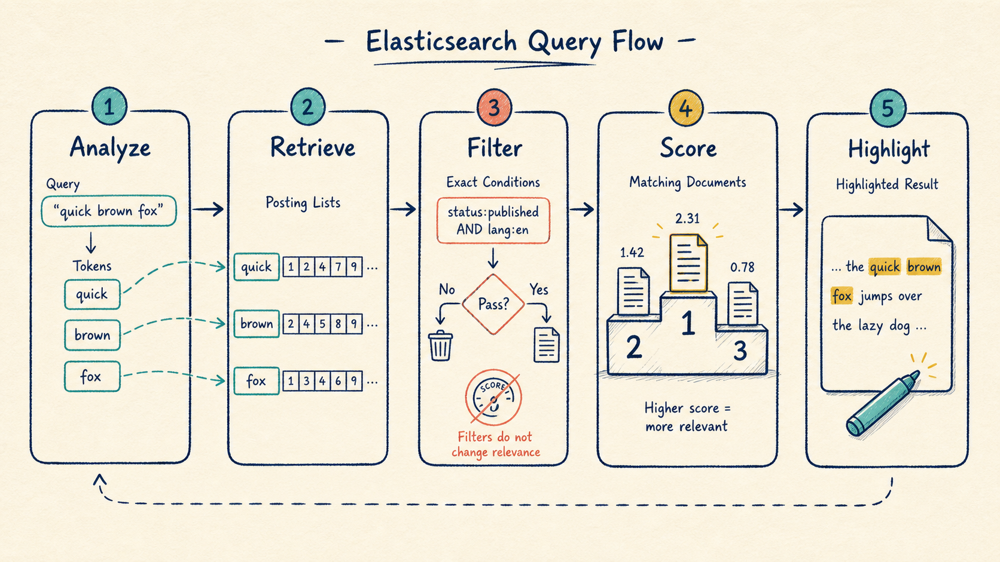
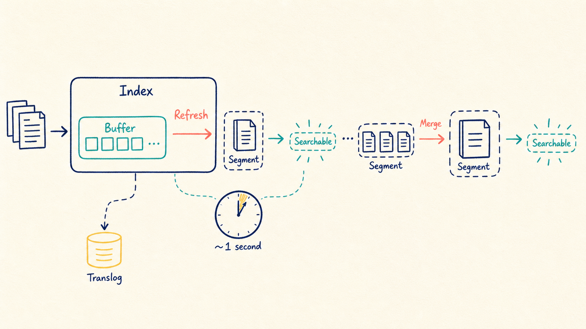
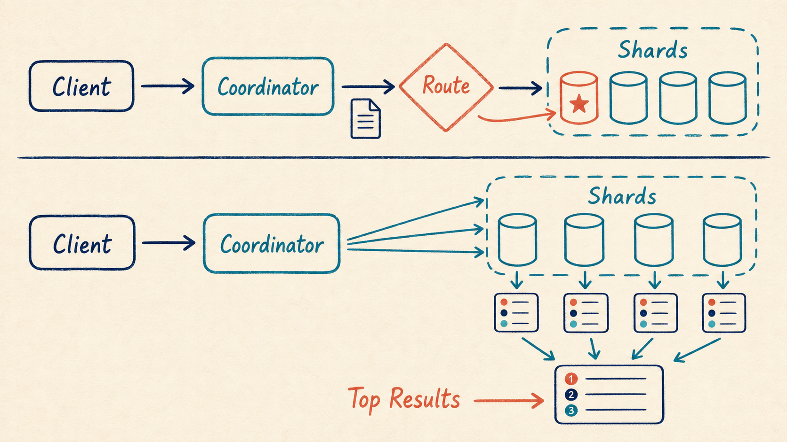
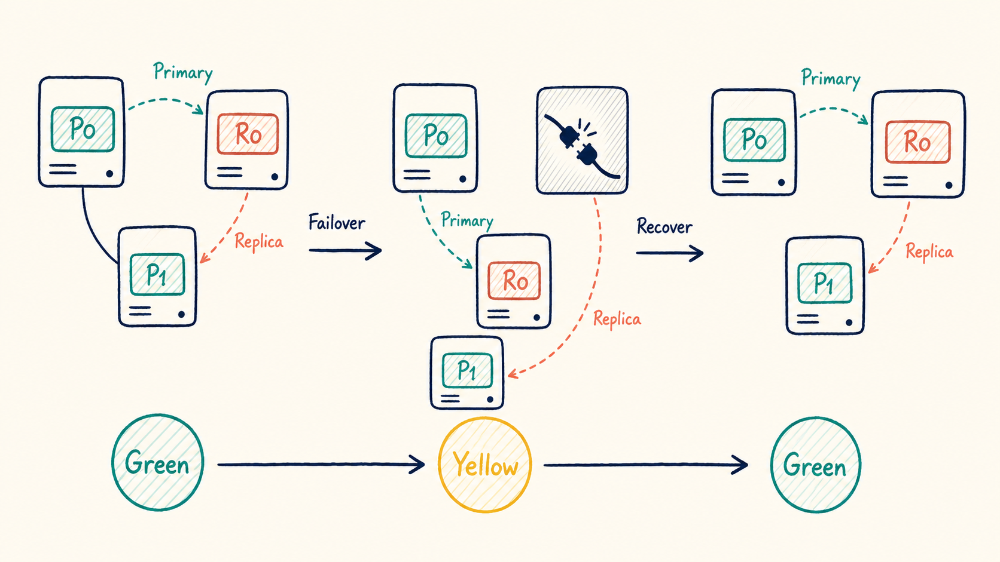
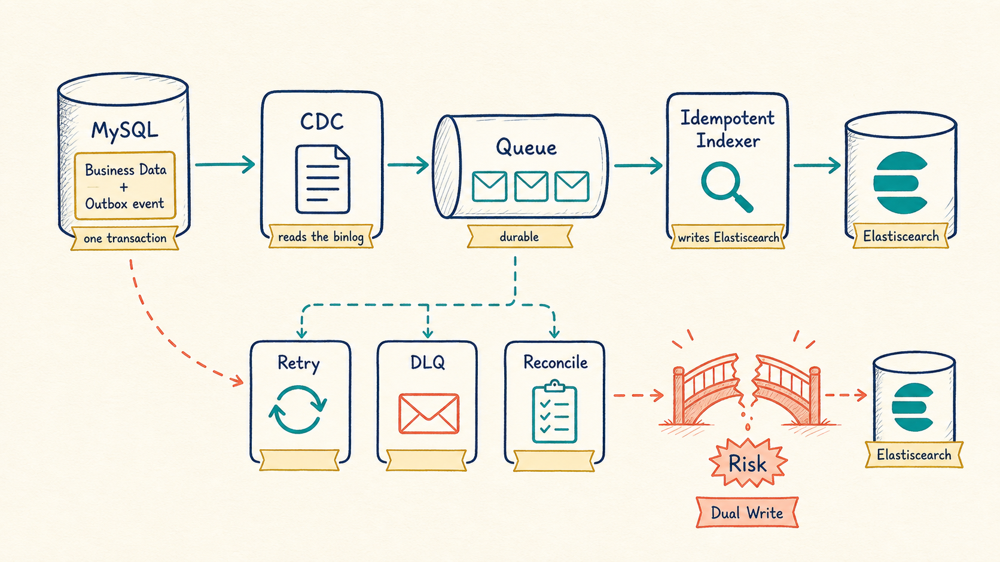
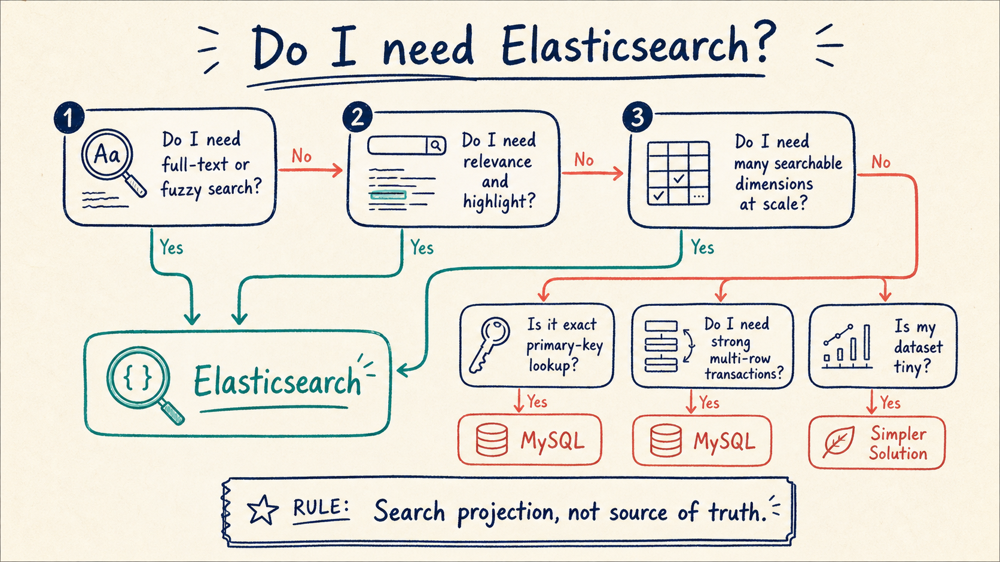

# Elasticsearch Made Simple: From a Search Box to a Cluster

> I may be broke, but I love learning. Of course, if someone gave me a hundred million, I would gladly pause this hobby and go have some fun.

[中文版](README.zh-CN.md)


This is not an Elasticsearch dictionary. We will follow one search request all the way down: why SQL search becomes awkward, why an inverted index helps, how documents become searchable, how shards work, and how to keep MySQL and Elasticsearch in sync.

---

## 1. We already have MySQL. Why add Elasticsearch?

Suppose the catalog contains this Chinese book title:

```text
黑萌影帝妙探妻
```

The user searches for the same ideas in a different order:

```text
影帝黑
```

We can parameterize a SQL query safely:

```sql
SELECT id, title
FROM book
WHERE title LIKE CONCAT('%', ?, '%');
```

But the search experience is still limited:

- reordered terms may not match;
- results have no natural relevance ranking;
- tokenization and highlighting are missing;
- a leading wildcard usually cannot use a normal B+Tree index efficiently;
- multi-field search quickly turns SQL into an octopus.

Elasticsearch is built to analyze text, retrieve candidates, rank them, and highlight useful fragments.


The practical rule is simple:

- MySQL stores the business truth: orders, inventory, balances, and constraints.
- Elasticsearch stores a search-oriented projection.
- Search can return IDs, then the application may load the freshest details from MySQL.

**MySQL owns the truth. Elasticsearch makes it easy to find.**

---

## 2. Full-text search is not a fancy `LIKE`



A full-text query roughly does four things:

1. analyze the input;
2. turn it into searchable terms;
3. retrieve matching documents;
4. calculate relevance and rank the results.

```json
GET books/_search
{
  "query": {
    "match": {
      "title": "影帝黑"
    }
  },
  "highlight": {
    "fields": {
      "title": {}
    }
  }
}
```

`match` analyzes the query. For an exact status, phone number, or order number, a `term` query on a `keyword` field is usually the better tool.

---

## 3. Why is Elasticsearch good at finding text?

Think of the index at the back of a paper book. Instead of scanning every page for “actor,” you first locate the word in the index and jump to the listed pages.



With three documents:

```text
1: 黑萌影帝妙探妻
2: 影帝今天很开心
3: 黑猫侦探社
```

a simplified inverted index might look like:

```text
黑   -> [1, 3]
影帝 -> [1, 2]
侦探 -> [3]
```

The left side is a term; the right side is its posting list. Lucene also records information such as frequency and positions for phrase matching and scoring.

This does not mean an inverted index is universally “faster” than MySQL's B+Tree. They solve different query shapes. Each Elasticsearch shard is a self-contained Lucene index, as described in Elastic's guide to [clusters, nodes, and shards](https://www.elastic.co/docs/deploy-manage/distributed-architecture/clusters-nodes-shards).

---

## 4. `text` or `keyword`?


A useful shortcut:

- analyze, search, and score text: `text`
- exact match, filter, sort, or aggregate: `keyword`

```json
PUT books
{
  "mappings": {
    "properties": {
      "title": {
        "type": "text",
        "fields": {
          "raw": { "type": "keyword" }
        }
      },
      "author": { "type": "keyword" },
      "price": { "type": "scaled_float", "scaling_factor": 100 },
      "published_at": { "type": "date" }
    }
  }
}
```

Now `title` supports full-text search while `title.raw` supports exact matching, sorting, and aggregation.

Design explicit mappings for production. A wrongly inferred field type often requires a new index and reindexing.

### What happened to mapping types?

Older examples use `index / type / document`. Modern Elasticsearch uses `index / document` and endpoints such as `/{index}/_doc/{id}`. Elasticsearch 8 no longer supports mapping types; see the official [removal of mapping types](https://www.elastic.co/docs/manage-data/data-store/mapping/removal-of-mapping-types).

---

## 5. The journey of a query



```json
GET books/_search
{
  "query": {
    "bool": {
      "must": [
        { "match": { "title": "影帝黑" } }
      ],
      "filter": [
        { "term": { "status": "published" } },
        { "range": { "price": { "lte": 9900 } } }
      ]
    }
  },
  "sort": [
    "_score",
    { "published_at": "desc" }
  ]
}
```

Keep two questions separate:

- `must`: how relevant is this document? Scoring matters.
- `filter`: is the status correct and is the price acceptable? The answer is only yes or no.

Highlighting, aggregations, and pagination can be added later. More features in one request do not automatically make a better query.

---

## 6. Why is a new document not always searchable immediately?

Elasticsearch provides **near-real-time** search, not instant search visibility.



A simplified path:

1. index the document;
2. place data in an in-memory buffer, with the translog supporting durability;
3. a refresh creates and opens a new Lucene segment;
4. that segment becomes searchable;
5. background merges combine small segments.

In the Elastic Stack, `index.refresh_interval` is typically `1s`. Elastic calls this [near-real-time search](https://www.elastic.co/docs/manage-data/data-store/near-real-time-search).

Avoid adding `refresh=true` to every write merely to see it immediately. It creates many tiny segments and moves cost into indexing, searching, and merging. The official [refresh parameter](https://www.elastic.co/docs/reference/elasticsearch/rest-apis/refresh-parameter) documentation recommends batching; when visibility must be awaited, use `refresh=wait_for` deliberately.

---

## 7. More shards are not automatically better

An index contains primary shards, and every shard is a Lucene index.



### Writes

Elasticsearch hashes `_routing` to select a primary shard. The document `_id` is the default routing value. Custom routing may narrow targeted searches, but can also create hot shards; the same routing value must be supplied for reads, updates, and deletes.

### Searches

Any node can become the coordinating node:

1. fan the query out to eligible shard copies;
2. collect local top results from each shard;
3. merge and sort them;
4. fetch the final documents.

This scatter-gather model is why excessive shard counts can hurt: every query has too many tiny departments to ask.

Two rules worth remembering:

- the primary shard count is normally fixed when an index is created; use reindex, split, or shrink to change the layout;
- the replica count can be changed dynamically.

Benchmark with realistic data and queries instead of choosing a large shard count “for future scale.”

---

## 8. Primaries and replicas



Replicas serve two jobs:

- a replica can be promoted if a primary's node fails;
- searches can use eligible shard copies to increase read capacity.

A primary and its replica should not live on the same node. Elasticsearch allocates and rebalances shard copies; for searches it normally uses [adaptive replica selection](https://www.elastic.co/guide/en/elasticsearch/reference/current/search-shard-routing.html), considering response time and queue size.

Cluster health in one minute:

- `green`: every primary and replica is allocated;
- `yellow`: primaries are available, but one or more replicas are unassigned;
- `red`: at least one primary is unavailable.

A one-node development cluster with one replica is commonly yellow: there is no second node on which to place that replica.

---

## 9. Moving data reliably from MySQL to Elasticsearch

| Approach | Good part | Catch |
|---|---|---|
| Periodic full load | easy to understand | slow and wasteful |
| Poll by update time | easy to implement | boundary gaps and duplicates |
| Application dual-write | looks direct | partial failure and tight coupling |
| Binlog / CDC | low application intrusion | ordering, duplicates, and recovery remain |
| Transactional outbox + CDC | event and data commit together | more components, clearer reliability |



A robust design:

1. write business data and an outbox row in one MySQL transaction;
2. use CDC to publish ordered events to a durable queue;
3. index them with a stable document ID;
4. reject stale events with a version or sequence number;
5. retry failures and move poison events to a DLQ;
6. reconcile MySQL and Elasticsearch periodically.

CDC does not remove the need for reconciliation. Queues handle routine delivery failures; reconciliation catches bugs, bad mappings, accidental deletion, and historical corruption.

---

## 10. A practical search document

User search may combine nickname, phone, tags, and membership level. Do not copy forty normalized tables into Elasticsearch. Build one document around the read use case:

```json
{
  "tenant_id": "shop_1001",
  "user_id": "u_9527",
  "nickname": "Xiangou",
  "phone": "13800000000",
  "level": "gold",
  "tags": ["java", "mysql"],
  "updated_at": "2026-07-23T10:00:00+08:00",
  "version": 37
}
```

A stable ID such as `tenant_id + ":" + user_id` makes repeated event delivery update the same document and supports idempotency.

Use `nested` only when multiple fields in an array must match within the same child object. It is not a free upgrade for every array.

The same principle applies to property search:

- use Elasticsearch for keywords, transit lines, neighborhoods, tags, and ranking;
- use MySQL when the query is a primary key or a few simple exact conditions;
- after search returns property IDs, decide whether consistency requirements justify loading current details from MySQL.

---

## 11. When should we use Elasticsearch?



### A good fit

- full-text and fuzzy search;
- relevance ranking, highlighting, and suggestions;
- multi-dimensional filtering and aggregation;
- horizontal scaling for search workload;
- controlled eventual consistency is acceptable.

### A poor replacement for

- balance or inventory updates requiring strong transactions;
- complex cross-document transactions;
- tiny datasets and simple queries;
- teams unable to operate the cluster and synchronization pipeline;
- requirements for absolute immediate search visibility.

Elasticsearch is not a box that makes every query fast. Bad mappings, excessive shards, deep pagination, large aggregations, high-cardinality fields, and unbounded queries can still drive CPU to 100%.

---

## 12. Pocket summary

```text
MySQL: business truth
Elasticsearch: search projection

text: analyze and search
keyword: exact match, filter, sort, aggregate

inverted index: term -> documents
refresh: make a new segment searchable
primary shard: data ownership
replica shard: resilience + read capacity

delivery may repeat, indexing must be idempotent
reliability = retry + DLQ + reconciliation
```

If you remember one sentence:

> **Do not use Elasticsearch merely to say you use Elasticsearch. Add it when search has become a real problem, then let it focus on search.**

---

## References

- [Elastic: Removal of mapping types](https://www.elastic.co/docs/manage-data/data-store/mapping/removal-of-mapping-types)
- [Elastic: Clusters, nodes, and shards](https://www.elastic.co/docs/deploy-manage/distributed-architecture/clusters-nodes-shards)
- [Elastic: Near real-time search](https://www.elastic.co/docs/manage-data/data-store/near-real-time-search)
- [Elastic: Refresh parameter](https://www.elastic.co/docs/reference/elasticsearch/rest-apis/refresh-parameter)
- [Elastic: Search shard routing](https://www.elastic.co/guide/en/elasticsearch/reference/current/search-shard-routing.html)
- [Elastic: `_routing` field](https://www.elastic.co/docs/reference/elasticsearch/mapping-reference/mapping-routing-field)
- [Original Chinese article](https://xiangou.blog.csdn.net/article/details/92105823)

