# Kafka Made Simple: From Message Delivery to Kafka vs RabbitMQ

> A message broker is like a company chat: sending is easy; the hard part is making sure the right people see the message, in the right order, without losing the conversation when a server fails.

[中文版](README.zh-CN.md)

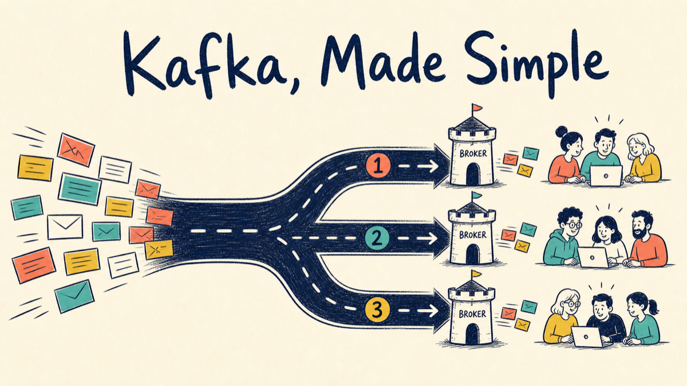

This guide follows one event through Kafka: production, partitioning, replication, consumption, offset commits, rebalances, failure recovery, and backlog handling. It then compares Kafka with RabbitMQ using their actual data models rather than slogans.

---

## 1. What is Kafka?

Kafka is often called a message queue, but a disappearing mailbox is the wrong mental model. Kafka is closer to a shared, append-only event ledger:

- producers append events;
- retention policies keep them for a period;
- each consumer group owns independent bookmarks;
- groups can consume the same events at different speeds;
- consumers can replay data while it remains retained.

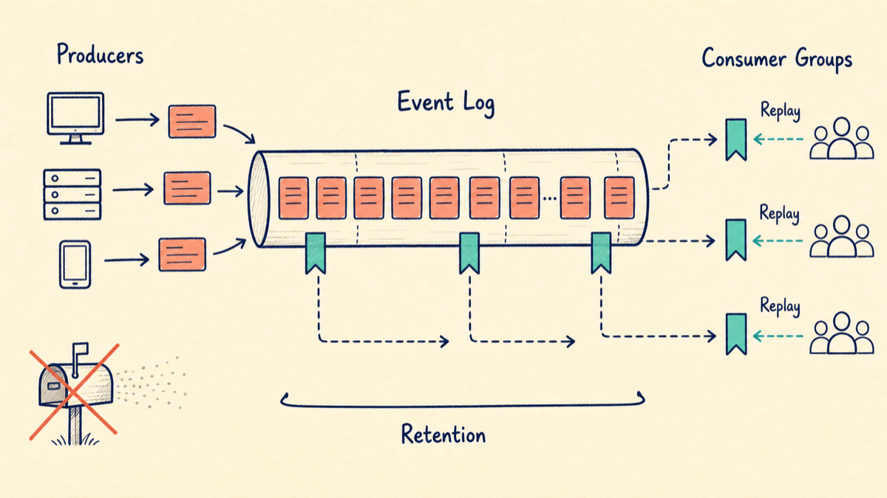

This model fits event-driven systems, traffic buffering, CDC, log collection, analytics, and stream processing.

Kafka does not make an application reliable by itself. Producer, broker, consumer, and database failures still need explicit handling.

---

## 2. Topic, partition, replica, and offset

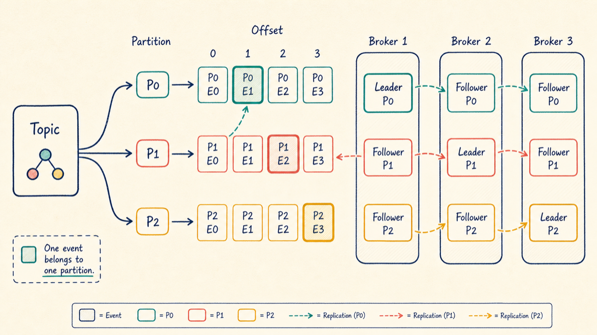

- **Topic**: a logical event category such as `order-created`.
- **Partition**: one parallel append-only log within a topic.
- **Offset**: a record's position inside one partition.
- **Leader replica**: handles reads and writes for the partition.
- **Follower replica**: copies the leader's log for resilience.
- **Broker**: a Kafka server process that stores replicas.

One record belongs to one partition. Replication copies that partition's log to other brokers; it does not place the business record in several unrelated partitions.

Apache Kafka 4.x runs in KRaft mode and no longer depends on ZooKeeper. Kafka 4.0 was the first major release to operate entirely without it; see the [Kafka 4.0 release announcement](https://kafka.apache.org/blog/2025/03/18/apache-kafka-4.0.0-release-announcement/).

---

## 3. What happens inside a producer?

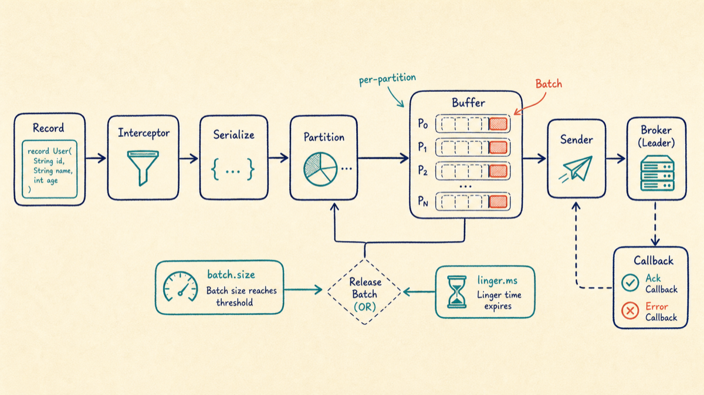

A simplified flow:

1. create a `ProducerRecord`;
2. run interceptors;
3. serialize key and value;
4. select a partition;
5. add the record to a per-partition batch;
6. let the sender thread transmit the batch;
7. receive an acknowledgement or error;
8. notify the Future or Callback.

`batch.size` and `linger.ms` are alternative release conditions: a full batch can leave immediately, or a partially filled batch can leave when the wait expires.

```java
producer.send(
    new ProducerRecord<>("order-created", orderId, event),
    (metadata, error) -> {
        if (error != null) {
            // record and handle the failure
            return;
        }
        // metadata contains topic, partition, and offset
    }
);
```

Asynchronous does not mean fire-and-forget. Observe the final result.

---

## 4. `acks`, ISR, and idempotent production

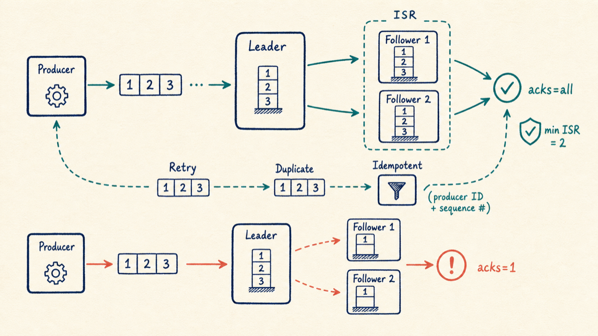

- `acks=0`: do not wait for the broker.
- `acks=1`: acknowledge after the leader writes locally.
- `acks=all`: wait for the required in-sync replicas.

A common durable baseline is:

```properties
acks=all
min.insync.replicas=2
```

When too few replicas are in sync, Kafka rejects the write instead of acknowledging a weaker durability level.

Modern Kafka also changes advice found in older articles. If there are no conflicting settings, idempotence is enabled by default and `retries` no longer defaults to zero. Producer IDs and sequence numbers prevent duplicate appends caused by automatic retries within a producer session.

With idempotence enabled, ordering is preserved with `max.in.flight.requests.per.connection` up to 5, provided its required settings are valid. It is no longer accurate to say that all ordered producers must set it to 1. See the [Kafka 4.2 producer configuration](https://kafka.apache.org/42/generated/producer_config.html).

Application-level duplicate calls are still application duplicates. Broker idempotence cannot guess that two separate `send()` calls represent one business request.

---

## 5. Does Kafka guarantee ordering?

Yes, within a partition. It does not provide global order across partitions.

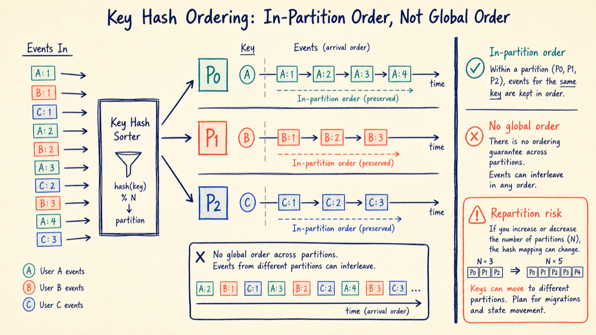

```java
new ProducerRecord<>("user-follow-events", userId, event)
```

A stable `userId` key routes one user's follow and unfollow events to the same partition:

- events for one user remain ordered;
- different users are processed in parallel;
- the topic keeps multi-partition throughput.

Increasing the partition count can remap keys and create a new ordering boundary between historical and new events. Partition expansion is therefore not a risk-free performance switch for order-sensitive topics.

---

## 6. Consumer groups

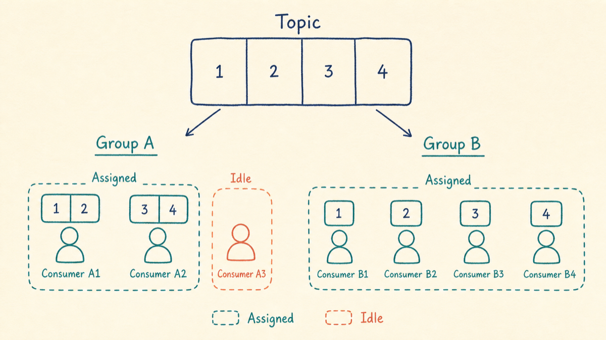

Within one group:

- one partition is assigned to at most one consumer at a time;
- one consumer may own multiple partitions;
- consumers beyond the partition count remain idle;
- another group consumes the same topic independently.

For four partitions:

```text
2 consumers: about 2 partitions each
4 consumers: about 1 partition each
8 consumers: about 4 active and 4 idle
```

Adding consumers does not help after partition parallelism is exhausted, and it never fixes a downstream database bottleneck.

---

## 7. An offset is a bookmark to the next record

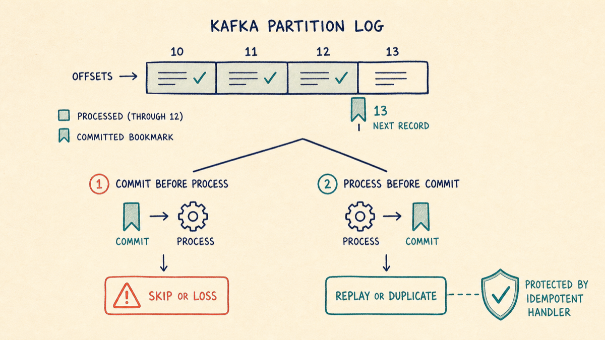

After successfully processing offset 12, the normal committed offset is 13. The commit means “resume here,” not “this was the last record I processed.” The [KafkaConsumer API](https://kafka.apache.org/42/javadoc/org/apache/kafka/clients/consumer/KafkaConsumer.html) states that the committed offset should be the next record the application will read.

- Commit before processing: a crash can skip business work.
- Process before committing: a crash can replay the record.

Most business consumers choose at-least-once and make handling idempotent. A unique `event_id`, recorded in the same local transaction as the business change, is safer than a non-atomic “check then insert.”

---

## 8. Rebalancing without mythology

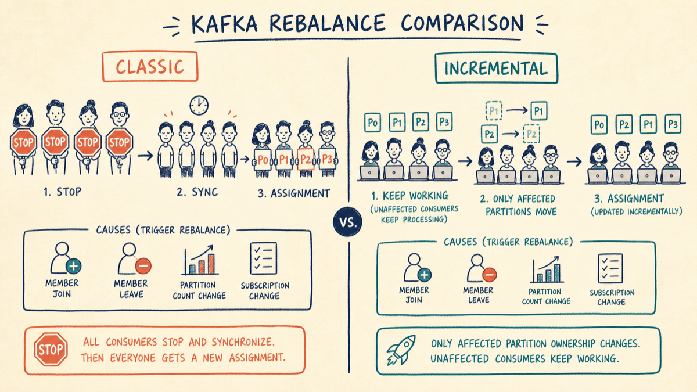

Partition assignment may change when:

- a consumer joins or leaves;
- the partition count changes;
- a regular-expression subscription finds a new topic;
- a consumer stops polling for too long;
- a classic-protocol member misses its heartbeat window.

A broker failure or partition-leader election is not automatically a consumer-group rebalance. Replica leadership and consumer partition assignment are different mechanisms.

Kafka 4.x also makes “every rebalance stops the whole group” an incomplete description. The new Consumer Rebalance Protocol is fully incremental and removes the global synchronization barrier, reducing rebalance time for large groups. It is generally available from Kafka 4.0; see the [official protocol guide](https://kafka.apache.org/42/operations/consumer-rebalance-protocol/).

```properties
group.protocol=consumer
```

It does not eliminate rebalances; it limits unnecessary disruption.

Reduce accidental rebalances by controlling batch size, keeping the poll loop responsive, monitoring processing latency and full GC, and configuring timeouts from real workloads rather than copying magic numbers.

---

## 9. At-most-once, at-least-once, and exactly-once

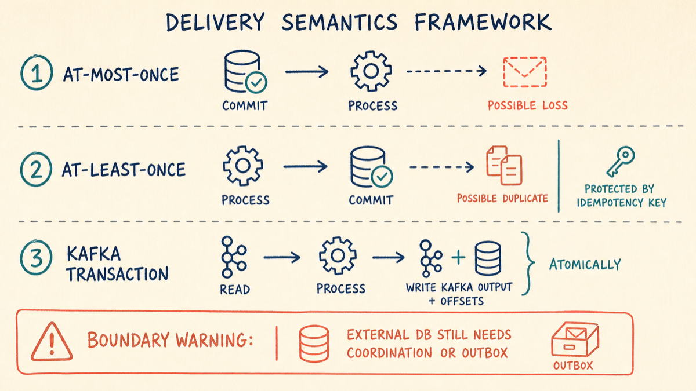

- **At-most-once**: commit, then process. Work may be skipped.
- **At-least-once**: process, then commit. Work may repeat, so handlers must be idempotent.
- **Kafka transaction**: atomically consume, produce Kafka output, and commit offsets for a Kafka read-process-write pipeline.

Kafka transactions do not silently include MySQL:

```text
Kafka transaction != automatic MySQL transaction
```

External side effects still need an outbox, CDC, idempotency keys, state machines, or reconciliation.

---

## 10. Backlog response: find the bottleneck first

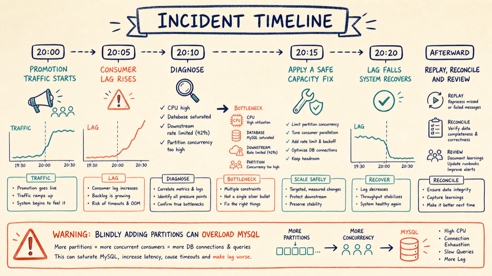

The original promotion incident is instructive:

```text
20:00 campaign starts
20:05 consumer lag rises
20:11 partitions increase from 4 to 10
20:15 MySQL CPU reaches 90%
20:20 lag clears
```

The pressure did not disappear; it moved from Kafka to MySQL.

Before scaling:

1. Is production unexpectedly high?
2. Is the consumer failing, pausing for GC, or rebalancing?
3. Which operation became slower?
4. Does partition count limit parallelism?
5. Can databases and remote services survive more concurrency?
6. Is retention long enough for recovery?
7. Is lag growing or shrinking?

Protect downstream systems with bounded connection pools, concurrency limits, batching, rate limits, backoff, and a DLQ or parking-lot queue. After recovery, reconcile business results: zero lag does not prove correct processing.

---

## 11. RabbitMQ uses a different mental model

RabbitMQ resembles a routing and delivery center:

1. a publisher sends to an exchange;
2. bindings route messages to one or more queues;
3. the broker pushes deliveries to consumers;
4. prefetch bounds unacknowledged work;
5. consumers Ack or Nack;
6. expired or rejected messages may move through a DLX to a DLQ.

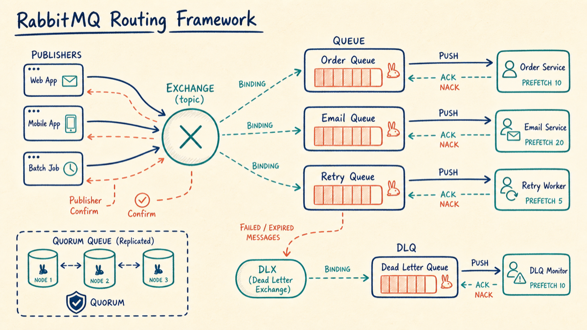

RabbitMQ offers direct, topic, fanout, and headers exchanges; message and queue TTL; dead-letter exchanges; and queue-specific priority behavior.

For replicated, highly available queues, RabbitMQ recommends quorum queues. Publisher confirms are issued after a quorum accepts the message, and consumers should use manual acknowledgements. See the [quorum queue guide](https://www.rabbitmq.com/docs/quorum-queues).

---

## 12. Kafka versus RabbitMQ

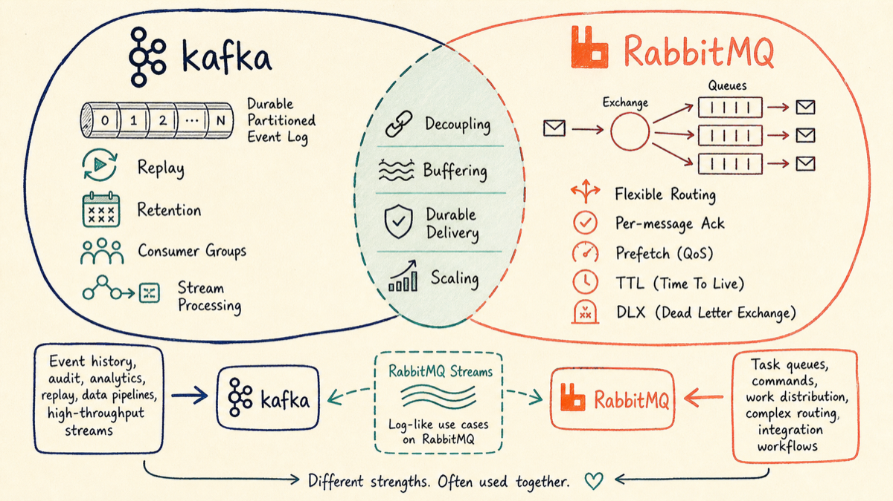

| Dimension | Kafka | RabbitMQ |
|---|---|---|
| Core model | retained, partitioned event log | exchange routes into queues |
| Consumption | consumers pull | broker pushes with prefetch |
| After consumption | retained by policy and replayable | normally removed after Ack |
| Scale unit | partition | queue and consumer; streams can be partitioned |
| Ordering | per partition | one queue can preserve order, but concurrency, redelivery, and priority affect observation |
| Routing | topic, key, partition | rich exchange and binding rules |
| Replay | a core capability | ordinary queues are not replay logs |
| Progress | group offsets | Ack state; streams use offsets |
| Failure workflow | often application retry topics and DLQs | Nack, requeue, TTL, and DLX are direct |
| Common fit | event backbone, CDC, logs, stream processing | task queues, commands, complex routing, workflows |

Choose Kafka when event history, replay, independent consumer groups, sustained throughput, or stream processing is central.

Choose RabbitMQ when messages are tasks or commands and flexible routing, TTL, DLX, per-message acknowledgement, and queue-oriented workflows matter most.

RabbitMQ Streams complicate any simplistic comparison: they are replicated append-only logs with replay, and Super Streams add partitioning. See the [RabbitMQ Streams documentation](https://www.rabbitmq.com/docs/streams). Compare concrete structures—Kafka partitions, classic queues, quorum queues, and streams—not only product names.

---

## 13. Pocket summary

```text
Topic: event category
Partition: parallelism and ordering boundary
Offset: position inside one partition
Replica: copy of a partition log
Consumer group: shares a partition set

Durable produce: acks=all + sensible min ISR + idempotence
Durable consume: process, commit, and make business work idempotent
Ordering: stable key -> stable partition
Backlog: diagnose, protect downstream, then scale

Kafka: retention, replay, event streams
RabbitMQ: routing, tasks, Ack, TTL, DLX
```

If you remember one sentence:

> **Kafka is not a giant list, and RabbitMQ is not a smaller Kafka. Decide whether the message is retained history or outstanding work before choosing the broker.**

---

## References

- [Apache Kafka 4.2 producer configuration](https://kafka.apache.org/42/generated/producer_config.html)
- [Apache Kafka 4.2 KafkaConsumer](https://kafka.apache.org/42/javadoc/org/apache/kafka/clients/consumer/KafkaConsumer.html)
- [Apache Kafka Consumer Rebalance Protocol](https://kafka.apache.org/42/operations/consumer-rebalance-protocol/)
- [Apache Kafka KRaft](https://kafka.apache.org/42/operations/kraft/)
- [RabbitMQ Exchanges](https://www.rabbitmq.com/docs/exchanges)
- [RabbitMQ Reliability Guide](https://www.rabbitmq.com/docs/reliability)
- [RabbitMQ Quorum Queues](https://www.rabbitmq.com/docs/quorum-queues)
- [RabbitMQ Streams and Super Streams](https://www.rabbitmq.com/docs/streams)
- [Original Chinese Kafka article](https://xiangou.blog.csdn.net/article/details/128408727)

