# 图解 MySQL 工程实践：从一条 SQL 到分库分表

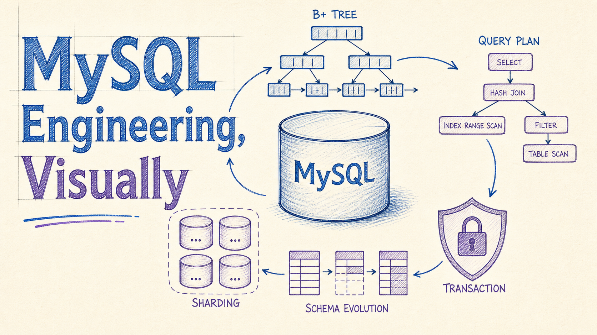

> 一份面向后端工程师的视觉速查：索引、执行计划、事务、MVCC、锁、在线 DDL 与分库分表。示例以 **MySQL 8.4 LTS** 为生产基线；截至 2026 年 7 月，**MySQL 9.7** 是当前创新版本。

## 先建立一张全局地图

一条 SQL 的性能和可靠性，通常由五层共同决定：

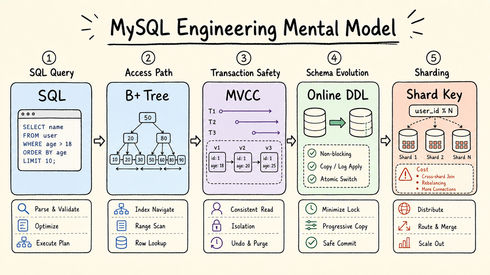

排查顺序也应由近及远：先看 SQL 与访问路径，再看事务和表结构，最后才考虑分片。不要用分布式复杂度掩盖单机问题。

## 1. 索引：目标不是“走索引”，而是少做工作

InnoDB 的主流索引结构是 B+ 树。它把多个键放进一个页中，用较高扇出降低树高；叶子页有序相连，因此点查和范围扫描都高效。InnoDB 默认页大小通常为 16 KiB，但一棵树能容纳多少行取决于行宽、键宽与页利用率，不能套用固定数字。

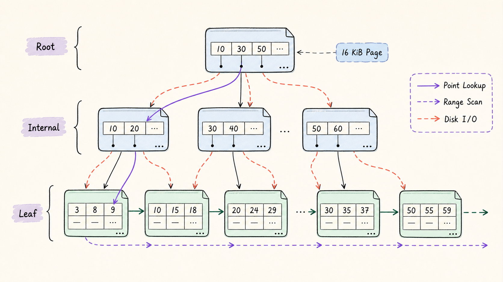

### 聚簇索引、二级索引与覆盖索引

- 聚簇索引的叶子节点保存整行记录。
- 二级索引的叶子节点保存二级键和主键值。
- 查询二级索引后再查聚簇索引，就是常说的“回表”。
- 所需列都在同一索引中时，可以直接返回，形成覆盖索引。

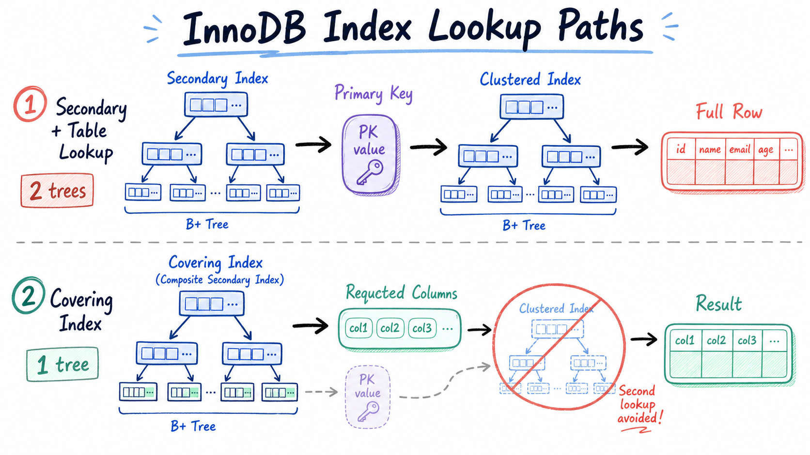

主键应当短、稳定，因为它也会出现在每个二级索引记录中。自增主键经常是好选择，但不是教条：它可能带来写热点，分布式 ID 也应结合写入局部性、索引宽度和业务语义评估。

### 联合索引：围绕查询模式排序

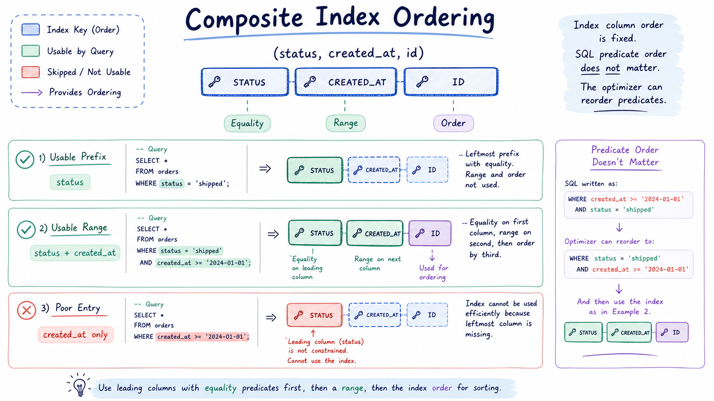

设计 `(status, created_at, id)` 时，关注的是索引的有序前缀：

```sql
CREATE INDEX idx_order_status_time
    ON orders (status, created_at, id);
```

等值条件通常放在范围条件之前；排序和覆盖需求也会影响后续列。SQL 中 `WHERE` 条件的书写顺序不决定索引能否使用，优化器可以重排谓词。

### 常见失效并不是简单口诀

```sql
-- 能形成前缀范围
WHERE phone LIKE '176%'

-- 通常无法从 B+ 树起点定位
WHERE phone LIKE '%176%'
```

对索引列做函数或发生隐式类型转换，可能破坏可搜索性。不过 MySQL 也支持函数索引、生成列索引等方案，应以实际执行计划为准。

## 2. 用 EXPLAIN ANALYZE 闭环，而不是猜

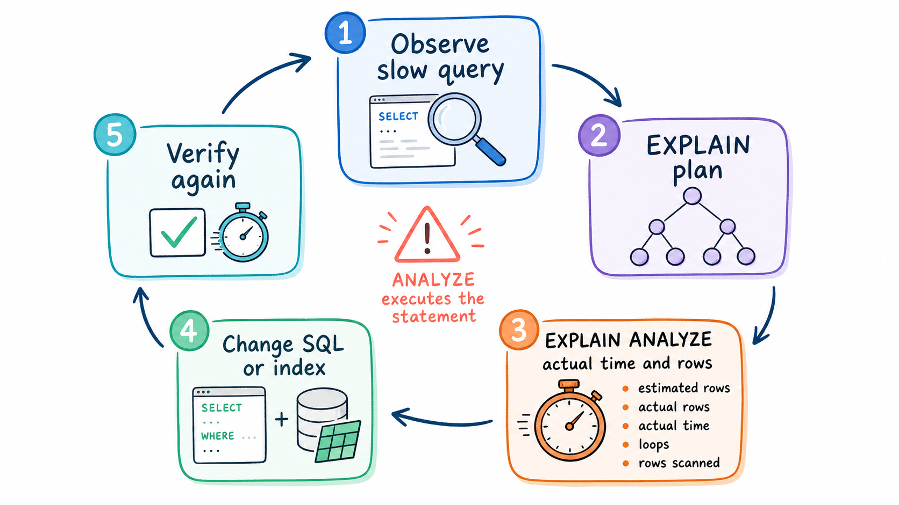

```sql
EXPLAIN FORMAT=TREE
SELECT id, status
FROM orders
WHERE status = 'PAID'
ORDER BY created_at DESC
LIMIT 50;

EXPLAIN ANALYZE
SELECT id, status
FROM orders
WHERE status = 'PAID'
ORDER BY created_at DESC
LIMIT 50;
```

重点对比：

- 估算行数与实际行数；
- 首行时间、总时间和循环次数；
- 扫描行数、排序、临时表与回表；
- 改动前后的真实结果。

`EXPLAIN ANALYZE` 会真正执行语句。对写语句或生产大查询使用前，应评估影响。

深分页也不要依赖“主键一定连续”：

```sql
-- 游标 / keyset pagination
SELECT id, created_at, title
FROM posts
WHERE (created_at, id) < (?, ?)
ORDER BY created_at DESC, id DESC
LIMIT 100;
```

它沿索引从上次位置继续，比不断增大的 `OFFSET` 更稳定。

## 3. 事务：日志、版本与锁各司其职

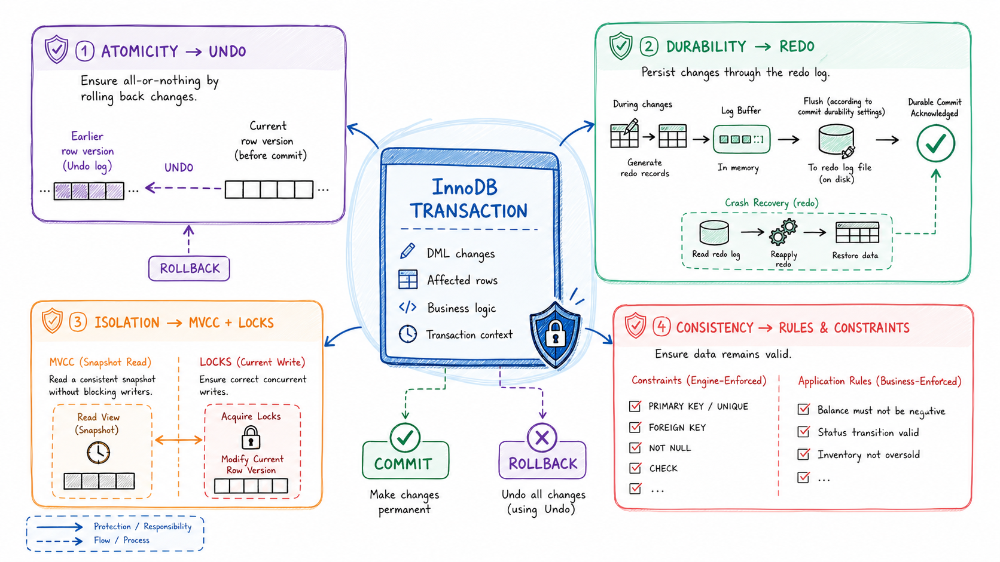

- **Undo** 支持回滚，并为一致性读重建旧版本。
- **Redo** 记录页修改，用于崩溃恢复。
- **MVCC** 让普通查询读取一致性快照。
- **锁** 保护当前读和写入冲突。

`innodb_flush_log_at_trx_commit=1` 提供最强的提交持久性语义。设置为 `2` 可能减少刷新开销，但操作系统或机器故障时可能丢失最近的提交；不能笼统地称为“无损”。

### MVCC：读的是哪个版本？

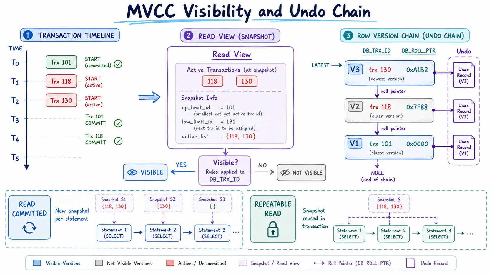

InnoDB 行记录包含事务标识和指向 Undo 的回滚指针。Read View 决定某个版本是否可见：

- `READ COMMITTED` 通常每条一致性读语句获得新快照；
- `REPEATABLE READ` 通常在事务内复用首次一致性读建立的快照；
- `UPDATE`、`DELETE`、`SELECT ... FOR UPDATE/FOR SHARE` 属于当前读。

因此，“事务一启动就一定创建快照”并不准确。长事务会让旧版本无法及时清理，也会延长锁的持有时间，应尽量缩小事务边界。

## 4. 锁：锁多少，首先取决于扫描多少

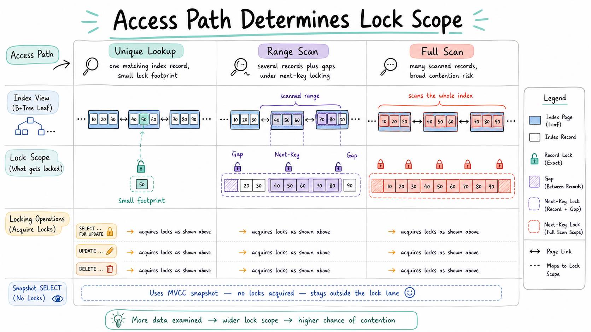

InnoDB 的锁基于索引记录和扫描范围。锁定读、`UPDATE` 或 `DELETE` 通常会锁住执行过程中扫描到的索引记录；在可重复读下，范围访问还可能使用 next-key locks。

所以：

- 唯一索引等值查找通常锁定范围最小；
- 范围扫描可能锁记录与间隙；
- 没有合适索引导致大范围扫描时，锁冲突会显著放大。

普通快照 `SELECT` 在 `READ COMMITTED` 和 `REPEATABLE READ` 下通常不加记录锁。与其说“InnoDB 是行锁所以不会锁表”，不如记住：**访问路径决定锁足迹**。

## 5. 表设计与在线变更：规范要服务于负载

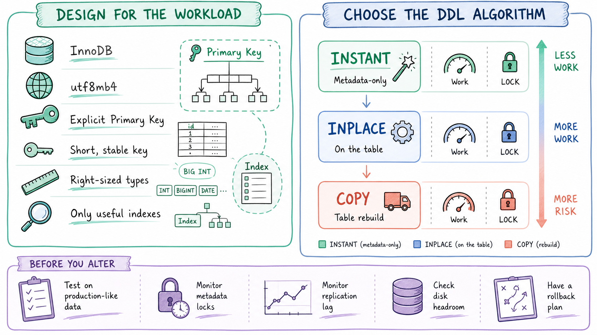

推荐默认值：

- 使用 InnoDB 与 `utf8mb4`；
- 显式定义主键，控制主键和索引宽度；
- 使用最小但足够的数据类型；
- 只创建能服务实际查询的索引；
- `NULL` 是否允许由业务语义决定，不要用 `0` 或特殊日期掩盖“未知”。

“禁止子查询”“索引列一律不能为 NULL”“ALTER 一定锁全表”都过于绝对。MySQL 优化器可以把部分子查询转换为 semi-join、派生表等计划；在线 DDL 能力则取决于具体操作、版本与 `ALGORITHM`：

```sql
ALTER TABLE orders
  ADD COLUMN source VARCHAR(32) NULL,
  ALGORITHM=INSTANT;
```

`INSTANT`、`INPLACE`、`COPY` 的代价差异很大。上线前应在相近数据量上验证，并监控 metadata lock、复制延迟、磁盘空间与回滚方案。

## 6. 分库分表：没有统一的行数阈值

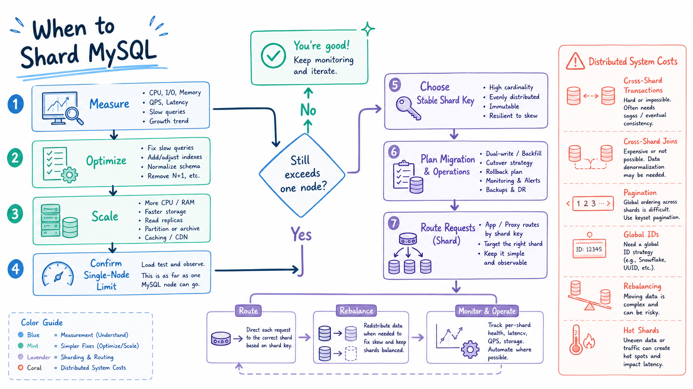

“500 万行”或“2000 万行”不是 MySQL 的硬上限。是否分片取决于：

- 工作集能否被缓存；
- 查询与索引是否合理；
- 写入吞吐、磁盘与复制能力；
- 延迟目标和运维窗口；
- 单节点扩容、归档、分区、读副本等手段是否已用尽。

只有经过测量，确认单节点瓶颈仍不可接受，才进入分片设计。

### 分片必须同时设计代价

选择 shard key 时同时考虑均匀性、查询局部性、热点和未来扩容。分片会引入：

- 跨分片事务和一致性；
- 跨库 JOIN、聚合与分页；
- 全局唯一 ID；
- 路由、扩容、数据迁移与热点分片；
- 更复杂的备份、恢复和可观测性。

MySQL 原生表分区是同一 MySQL 实例内的数据组织方式，不等于跨节点分库分表。MySQL 8.4 的 InnoDB 分区还有外键等限制。

## 一页检查清单

1. 先用慢日志、指标和 `EXPLAIN ANALYZE` 找到真实瓶颈。
2. 让索引匹配过滤、排序、连接与覆盖需求。
3. 让事务短小，并理解快照读与当前读。
4. 用访问路径推断锁范围。
5. 对 DDL 明确算法、锁级别、空间和回滚方案。
6. 最后才用分片换取容量，并显式承担分布式成本。

## 资料与延伸阅读

本文整合并更新了作者此前的五篇笔记：

- [MySQL 索引](https://xiangou.blog.csdn.net/article/details/106245641)
- [MySQL 事务和锁](https://xiangou.blog.csdn.net/article/details/115595598)
- [数据库 CRUD 与在线修改](https://xiangou.blog.csdn.net/article/details/115499603)
- [数据库设计规范](https://xiangou.blog.csdn.net/article/details/121448905)
- [分库分表](https://xiangou.blog.csdn.net/article/details/128910863)

官方参考：

- [MySQL 8.4 Reference Manual](https://dev.mysql.com/doc/refman/8.4/en/)
- [Optimization and Indexes](https://dev.mysql.com/doc/refman/8.4/en/optimization-indexes.html)
- [InnoDB Multi-Versioning](https://dev.mysql.com/doc/refman/8.4/en/innodb-multi-versioning.html)
- [Locks Set by Different SQL Statements](https://dev.mysql.com/doc/refman/8.4/en/innodb-locks-set.html)
- [EXPLAIN Statement](https://dev.mysql.com/doc/refman/8.4/en/explain.html)
- [Online DDL Operations](https://dev.mysql.com/doc/refman/8.4/en/innodb-online-ddl-operations.html)
- [Partitioning Overview and Limitations](https://dev.mysql.com/doc/refman/8.4/en/partitioning-overview.html)
- [MySQL 9.7 Release Notes](https://dev.mysql.com/doc/relnotes/mysql/9.7/en/)
